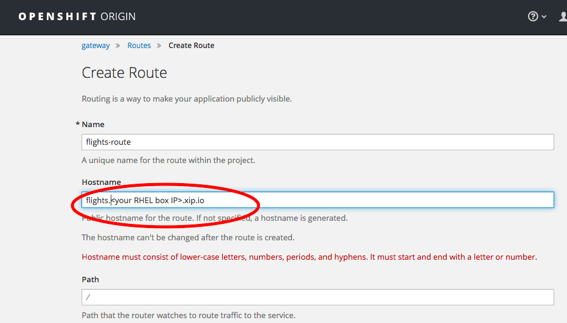

# Steps {#steps}

Here the URLs assume you have installed Openshift on AWS. Correct as appropriate.

1.  Setup Openshift on a RHEL or other appropriate Linux machine. You will probably have this already. If not, see Appendix 1 for the steps to do a very basic Openshift installation on AWS.
2.  Install Client tools if not already on your local machine. See Appendix 1 if not.
3.  Start Docker on your RHEL box: sudo systemctl start docker
4.  Fire up Openshift:sudo /home/ec2-user/oc-cli-tools/oc cluster up --public-hostname**_=&lt;your RHEL host&gt;_** --routing-suffix=**_&lt;RHEL box IP&gt;_**.xip.io
5.  Login to Openshift web console (credentials **_developer/developer_** work by default)https://**_&lt;your RHEL host&gt;_**.compute-1.amazonaws.com:8443
6.  On your local machine:
    *   oc login https://**_&lt;your RHEL host&gt;_**.compute-1.amazonaws.com:8443
    *   oc new-project &quot;3scalegateway&quot; --display-name=&quot;gateway&quot; --description=&quot;3scale gateway demo&quot;
7.  On 3scale:
    *   get an Access Token. Follow these: Gear Icon -&gt; Personal Settings -&gt; Tokens -&gt; Add Access Token. Name it, give it Read Write Access to everything, Create it and copy it somewhere (you won’t be able to get it again)
    *   Align your Public Base URL in 3scale with the Openshift Route you will create shortly:
    *   Go To API -&gt; Integration -&gt; edit integration settings:
    *   Choose Nginx Self-Managed Gateway then click Update Service at the bottom.
    *   Scroll to the bottom of the Integration Page and enter this in the _Public Base URL_ then _Update Production Configuration_:http://flights.&lt;your RHEL box IP&gt;.xip.io:80

This is the public base URL you will use to access this service.

1.  On Openshift, create a Route corresponding to the Public Base URL you just created on 3scale (without the protocol and port).
2.  On your local machine
    *   create a secret:oc secret new-basicauth threescale-portal-endpoint-secret --password=https://**_&lt;access token created above&gt;_**@**_&lt;your 3scale host&gt;_**(**_&lt;your 3scale host&gt;_ **is in the format: xyz-admin.3scale.net)
    *   create the app:oc new-app -f [https://raw.githubusercontent.com/3scale/rhamp-openshift-templates/1.0.0.GA/apicast-gateway/apicast-gateway-template.yml](https://raw.githubusercontent.com/3scale/rhamp-openshift-templates/1.0.0.GA/apicast-gateway/apicast-gateway-template.yml)This deploys the Gateway on Openshift.
3.  Test the API:http://flights.**_&lt;your RHEL IP&gt;_**.xip.io/flights/intl/flights?user_key=**_&lt;your user key&gt;_**You’ll find **_&lt;your user key&gt;_ **on the Integration screen in 3scale where you set your Public Base URL above.Check your API calls are registered by going to the Analytics screen on 3scale. See previous workshop, _3scaleWorkshop-BasicConfig.docx_, for details on that.

Note, if you make any changes to the Integration page on 3scale, you’ll normally have to re-deploy on Openshift to pull down the new config to Openshift.